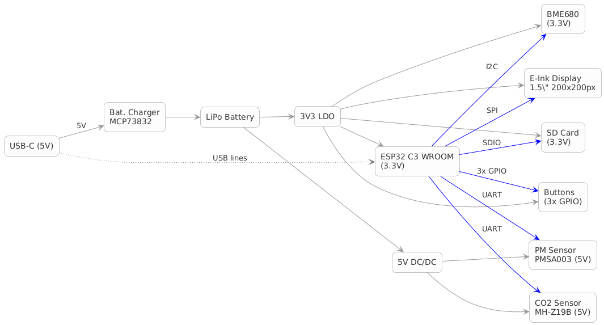

"# TSC" 
# OpenBook E-Reader

---

## 1. Diagrama Bloc a Sistemului

Diagrama bloc prezinta componentele principale ale sistemului si modul in care acestea sunt interconectate:

- **USB-C (5 V)**
  - Este conectat la incarcatorul de baterie (MCP7382) si alimenteaza sistemul prin aceasta sursa.
  - Permite incarcarea bateriei LiPo.

- **Baterie LiPo**
  - Este incarcata prin modulul MCP7382.
  - Asigura alimentare portabila atunci cand USB-C nu este disponibil.

- **Regulator 3.3 V (LDO)**
  - Primeste alimentarea din bateria LiPo si furnizeaza tensiunea stabila de 3.3 V.
  - Alimenteaza modulul ESP32-C3 WROOM si periferiile care functioneaza la 3.3 V.

- **ESP32-C3 WROOM (3.3 V)**
  - Este inima sistemului, unind toate interfetele principale (I2C, SPI, UART, GPIO).
  - Se conecteaza la:
    - **BME680** (senzor ambiental) prin I2C.
    - **E-Ink Display** (1,59", 200x200px) prin SPI.
    - **Card SD** prin SPI.
    - **Butoane** (3, prin GPIO) pentru interactiune.
    - **PMSA003** (senzor particule) prin UART.
    - **MH-Z19B** (senzor CO2) printr-un alt port UART.

- **5 V DC/DC**
  - Produce 5 V din sursa USB-C pentru senzorii care necesita aceasta tensiune (de ex. PMSA003 si MH-Z19B).
  - Asigura alimentarea si interfatarea UART pentru acesti senzori.

Fluxul de semnale si alimentare este astfel organizat:
- I2C este folosit pentru comunicatia cu BME680.
- SPI este utilizat pentru E-Ink Display si pentru cardul SD, cu linii CS separate pentru fiecare modul.
- GPIO este folosit pentru butoane.
- Doua porturi UART sunt dedicate pentru senzorii PMSA003 si MH-Z19B, care functioneaza la 5 V datorita sursei DC/DC.

> **Imaginea Diagramei Bloc**  
> 

---

## 2. Bill Of Materials (BOM)

Tabelul de mai jos prezinta lista detaliata a componentelor utilizate, inclusiv referinte catre paginile de achizitie (Mouser, Comet) si link-uri catre datasheet-uri.

| Nume Componenta                | Descriere & Specificatii                                                                                                  | Valoare/Caracteristici       | Cantitate | Link Achizitie                                                          | Datasheet Link                                                          |
|--------------------------------|--------------------------------------------------------------------------------------------------------------------------|------------------------------|-----------|-------------------------------------------------------------------------|-------------------------------------------------------------------------|
| **ESP32-C6-WROOM-1-N8**        | Modul Wi-Fi/Bluetooth bazat pe ESP32-C6                                                                                  | –                            | 1         | [Mouser](https://www.mouser.com/) *(cautati ESP32-C6-WROOM-1-N8)*         | [Datasheet](https://www.mouser.co.uk/datasheet/2/891/Espressif_ESP32_C6_WROOM_1__Datasheet_V0_1_PRELIMI-3239987.pdf) |
| **W25Q512JVEIQ**               | Memorie Flash SPI Serial                                                                                                 | 512Mb (64 MB)                | 1         | [Mouser](https://www.mouser.com/productdetail/W25Q512JVEIQ)                | [Datasheet](https://www.snapeda.com/parts/W25Q512JVEIQ/Winbond+Electronics/view-part/?ref=eda) |
| **BME688**                     | Senzor ambiental integrat (temperatura, umiditate, presiune, calitatea aerului)                                          | –                            | 1         | [Mouser](https://www.mouser.co.uk/) *(cautati BME688)*                    | [Datasheet](https://www.mouser.co.uk/datasheet/2/783/bst_bme688_fl000-2307034.pdf)            |
| **DS3231SN#**                  | Modul RTC cu detecţie de tensiune                                                                                         | –                            | 1         | [Mouser](https://www.mouser.com/productdetail/DS3231SN#)                  | [Datasheet](https://www.mouser.co.uk/datasheet/2/609/DS3231-3421123.pdf)                      |
| **112A-TAAR-R03 ATTEND**       | Socket pentru card MicroSD, tip Push-Push, SMT                                                                           | –                            | 1         | [Comet](https://store.comet.srl.ro/Catalogue/Product/43497/)              | [Datasheet](https://www.attend.com.tw/data/download/file/112A-TAAR-R03.rar)                   |
| **USB4110-GF-A**               | Conector USB Type-C SMT (Right Angle)                                                                                    | –                            | 1         | [Mouser](https://www.mouser.co.uk/) *(cautati USB4110-GF-A)*                | [Datasheet](https://www.mouser.co.uk/datasheet/2/837/GCT_USB4110_Product_Drawing___20k_cycles-3455479.pdf) |
| **FH34SRJ-24S-0.5SH**           | Conector FFC/FPC (Right Angle)                                                                                           | –                            | 1         | [Mouser](https://mou.sr/43Cr53R)                                           | [Datasheet](https://www.mouser.co.uk/datasheet/2/185/FH34SRJ_24S_0_5SH_99__CL0580_1255_6_99_2DDrawing_0-1615044.pdf) |
| **QWIIC Connector (JS-1MM)**   | Conector standard Qwiic pentru comunicatii I2C                                                                          | –                            | 1         | –                                                                       | [Datasheet](https://www.mouser.co.uk/datasheet/2/813/Qwiic_Connector_Datasheet-1223982.pdf)    |
| **MCP73831**                   | Controler de incarcare Li-Ion/Li-Pol                                                                                     | Curent maxim 500 mA, 4.2V      | 1         | [Mouser](https://www.mouser.co.uk/productdetail/Microchip-Technology/MCP73831T-2ACI-OT?qs=yUQqVecv4qvbBQBGbHx0Mw%3D%3D)  | [Datasheet](https://www.mouser.co.uk/datasheet/2/268/MCP73831_Family_Data_Sheet_DS20001984H-3441711.pdf) |
| **XC6220A331MR-G**             | Regulator LDO de tensiune                                                                                                 | 3.3V, 300mA, curent de repaus 50µA | 1    | [Mouser](https://www.mouser.co.uk/productdetail/XC6220A331MR-G)             | [Datasheet](https://www.mouser.co.uk/datasheet/2/760/xc6220-3371556.pdf)                     |
| **MAX17048G+T10**              | Circuit pentru masurarea nivelului bateriei (fuel gauge)                                                                 | –                            | 1         | [Mouser](https://www.mouser.co.uk/productdetail/MAX17048G+T10)              | [Datasheet](https://www.mouser.co.uk/datasheet/2/609/MAX17048_MAX17049-3469099.pdf)             |
| **BD5229G-TR**                 | Detector de tensiune, cu intarziere reglabila                                                                            | –                            | 1         | [Mouser](https://mou.sr/421TSO9)                                          | [Datasheet](https://fscdn.rohm.com/en/products/databook/datasheet/ic/power/voltage_detector/bd52xxg-e.pdf)  |
| **DMG2305UX-7**                | MOSFET P-channel                                                                                                         | – (Tip 20V/4.2A)             | 2         | [Diodes Incorporated](https://componentsearchengine.com/part-view/DMG2305UX-7) | [Datasheet](https://www.diodes.com/assets/Datasheets/DMG2305UX.pdf)                           |
| **SI1308EDL-T1-GE3**           | MOSFET N-channel                                                                                                         | –                            | 1         | [Mouser](https://www.mouser.co.uk/productdetail/SI1308EDL-T1-GE3)           | [Datasheet](https://www.vishay.com/doc?63399)                           |
| **Rezistori RR0402**           | Rezistori de precizie (ex.: 10kΩ – 200Ω, diverse valori)                                                                 | Exemplu: 10kΩ (15 buc.)       | Var.      | [Mouser](https://www.mouser.co.uk/) *(cautati RR0402)*                     | [Datasheet](https://componentsearchengine.com/part-view/R0402%201%25%20100%20K%20(RC0402FR-07100KL) |
| **Capacitori CC0402**          | Capacitori MLCC – diverse valori (ex.: 100nF, 1µF/50V, 4.7µF)                                                          | Var.                        | Var.      | [Mouser](https://www.mouser.co.uk/) *(cautati CC0402)*                    | [Datasheet](https://eu.mouser.com/datasheet/2/40/cx5r_KGM-3223198.pdf)                        |
| **MBR0530**                    | Diode Schottky – SMD                                                                                                     | –                            | 3         | [Onsemi](https://www.onsemi.com/PowerSolutions/product.do?id=MBR0530T3G)    | [Datasheet](https://www.onsemi.com/PowerSolutions/product.do?id=MBR0530T3G)                   |
| **PGB1010603MR**               | TVS / ESD Suppressor – Diode Array                                                                                       | –                            | 6         | [Mouser](https://www.mouser.co.uk/productdetail/PGB1010603MR)               | [Datasheet](https://www.littelfuse.com/assetdocs/pulseguard-esd-suppressors-pgb1-datasheet?assetguid=8a337998-d54d-466b-be4e-dc5bcd1f9321) |
| **CPH3225A**                   | Supercapacitor (capacitor polarizat)                                                                                     | 100µF, 3.3V                  | 1         | [Mouser](https://mou.sr/42aoXOc)                                          | [Datasheet](https://www.snapeda.com/parts/CPH3225A/Seiko+Instruments/view-part/?ref=eda)       |
| **744043680**                  | Inductor – tipul utilizat in circuitele de filtrare                                                                     | 68µH                        | 1         | [Mouser](https://eu.mouser.com/ProductDetail/Wurth-Elektronik/744043680)   | [Datasheet](https://www.we-online.com/components/products/datasheet/744043680.pdf)             |
| **USBLC6-2SC6Y**               | Diode de protectie ESD sub forma de array                                                                                | –                            | 1         | [Mouser](https://www.mouser.co.uk/productdetail/USBLC6-2SC6Y)              | [Datasheet](https://www.mouser.co.uk/datasheet/2/389/usblc6_2sc6y-1852505.pdf)                |
| **SD0805S020S1R0**             | Diode Schottky suplimentare pentru protectia circuitelor USB                                                             | –                            | 2         | [Mouser](https://www.mouser.co.uk/productdetail/SD0805S020S1R0)             | [Datasheet](https://www.mouser.co.uk/datasheet/2/40/schottky-3165252.pdf)                     |
| **Test Points (TPTP20R)**      | Puncte de testare pentru diagnosticare si debug                                                                        | –                            | 17        | [Mouser](https://www.mouser.co.uk/datasheet/2/215/5265_5269-2935484.pdf)   | [Datasheet](https://www.mouser.co.uk/datasheet/2/215/5265_5269-2935484.pdf)                     |
| **SMD Solder Jumper (SJ)**     | Jumper pentru configurarea optiunilor de circuit                                                                         | –                            | 1         | [Mouser](https://www.mouser.co.uk/productdetail/SJ)                        | [Datasheet](https://www.mouser.co.uk/datasheet/2/210/ASC_WR-3314721.pdf)                      |
| **LED Indicator (verde)**      | LED pentru indicatorii de stare (incarcare, activitate)                                                                  | –                            | 1         | [SnapEDA](https://www.snapeda.com/parts/ADAFRUIT_LEDCHIP-LED0603)           | [Specs](https://www.3dcontentcentral.com/secure/download-model.aspx?catalogid=9481&id=681976)   |

*Pentru componentele pentru care linkul direct nu este disponibil, se recomanda cautarea pe site-urile Mouser sau Comet folosind numarul de parte indicat.*

---

## 3. Descrierea Functionalitatii Hardware

### 3.1. Modulul de Procesare – ESP32-C6
- **Arhitectura:** Microcontroler de 32 de biti, bazat pe nucleul RISC-V, cu frecventa de operare de pana la 160 MHz.
- **Conectivitate:** Suporta Wi-Fi 6, Bluetooth LE si interfata USB 2.0.
- **Memorie:** 512 KB SRAM intern cu 8 MB Flash extern.
- **Moduri de Economisire a Energiei:** Diferite stari de consum redus (deep sleep sub 50 µA) pentru prelungirea duratei de viata a bateriei.

### 3.2. Submodulele Periferice
- **Memorie Externa:**  
  - *W25Q512JVEIQ* – Memorie Flash SPI utilizata pentru stocarea firmware-ului si a datelor.
- **Display E-Paper:**  
  - Afisaj de 7,5" (rezolutie 800x480) cu interfata SPI; consum redus, activ doar in timpul actualizarilor.
- **Senzor Ambiental – BME688:**  
  - Masoara temperatura, umiditatea, presiunea si calitatea aerului. Conectare prin I2C la 400kHz.
- **Modul RTC – DS3231SN:**  
  - Asigura mentinerea corecta a timpului si poate genera intreruperi pentru functii de wake-up.
- **Card MicroSD:**  
  - Pentru extinderea capacitatii de stocare; utilizat in cazul incarcarii ebook-urilor, logurilor si firmware-ului.
- **USB-C & Protectie ESD:**  
  - Interfata combinata pentru incarcarea si transferul de date; include protectie integrata pentru siguranta circuitelor.
- **Sistemul de Alimentare:**  
  - Include bateria Li-Po (2500 mAh), circuit de incarcare MCP73831, monitorizare baterie MAX17048 si un regulator LDO XC6220A331MR-G pentru o tensiune stabila de 3.3V.
- **Componente pentru Interfata cu Utilizatorul:**  
  - Butoane tactile (3) si LED-uri indicator pentru control si feedback.

### 3.3. Comunicații si Interfete
- **I2C:**  
  - Utilizat pentru conectarea senzorului BME688, RTC-ului DS3231 si a circuitului de monitorizare a bateriei (MAX17048).
- **SPI:**  
  - Folosit pentru afisajul e-Paper, memoria Flash si cardul MicroSD (fiecare avand linie CS proprie).
- **USB:**  
  - Comunicarea si incarcarea se realizeaza prin conectorul USB-C, asigurand si protectie ESD.
- **GPIO si Alte Conexiuni Digitale:**  
  - Butoane, LED-uri si semnale de control (reset, boot etc.) sunt gestionate prin pini dedicati.

### 3.4. Estimarea Consumului de Energie
Consumurile sunt estimate astfel:
- **ESP32-C6:**  
  - Activ: ~80–150 mA; Deep Sleep: sub 50 µA.
- **Display E-Paper:**  
  - Actualizare: ~30–40 mA; Stare statica: ~1 µA.
- **BME688:**  
  - Activ: ~2.1 mA; Standby: sub 1 µA.
- **RTC DS3231:**  
  - Aproximativ 2 µA in mod continuu.
- **Sistem complet:**  
  - Citire completa: ~120–170 mA; activitati cu Wi-Fi si senzori: ~100–130 mA; Deep Sleep: ~100–150 µA.

---

## 4. Harta Pinilor ESP32-C6 si Functiile Asociate

Aceasta sectiune detaliaza maparea pinilor ESP32-C6 conform proiectului, explicand rolul fiecarei conexiuni:

| Pin ESP32-C6    | Functie / Eticheta din Schema  | Modul Conectat                                          | Rol si Motiv                                                                                  |
|-----------------|--------------------------------|---------------------------------------------------------|-----------------------------------------------------------------------------------------------|
| **IO1 (SDA)**   | I2C Data                       | Conecteaza BME688, MAX17048 si DS3231                   | Permite comunicarea pe magistrala I2C pentru senzori si RTC.                                   |
| **IO2 (SCL)**   | I2C Clock                      | Conecteaza BME688, MAX17048 si DS3231                   | Sincronizeaza transferul de date pe magistrala I2C.                                           |
| **IO5 (MISO)**  | SPI – E-Paper                  | Conectat la afisajul E-Paper (receptie de date)         | Primeste datele de la afisajul e-Paper prin interfata SPI.                                    |
| **IO6 (MOSI)**  | SPI – E-Paper                  | Transmitere catre afisajul E-Paper                      | Trimite date catre afisajul e-Paper pentru actualizari.                                       |
| **IO7 (SCK)**   | SPI Clock (E-Paper)            | Sincronizarea transferului de date pentru e-Paper       | Asigura temporizarea corespunzatoare a semnalelor SPI intre microcontroler si afisaj.           |
| **IO8 (CS)**    | SPI Chip Select – E-Paper      | Selecteaza afisajul E-Paper                              | Activeaza comunicarea cu afisajul selectat prin linia CS.                                     |
| **IO9**         | Data/Command (DC) – E-Paper    | Controleaza modul comanda vs. date pentru E-Paper       | Indica tipul de date transmise (comanda sau informatie de afisare).                             |
| **IO10**        | Reset – E-Paper                | Reset hardware pentru afisajul E-Paper                  | Utilizeaza acest pin pentru initializarea sau resetarea afisajului.                           |
| **IO11**        | Busy – E-Paper                 | Semnal de ocupare de la afisajul E-Paper                | Indica disponibilitatea afisajului pentru noi comenzi.                                        |
| **IO12**        | Boot Button                    | Buton dedicat pentru intrarea in modul de boot           | Permite intrarea in modul de programare.                                                      |
| **IO13**        | Reset Button                   | Buton hardware pentru resetarea ESP32-C6                | Permite resetarea sistemului.                                                                 |
| **IO14**        | Buton User                     | Buton definit pentru interactiuni suplimentare          | Asigura o interfata suplimentara pentru navigarea in aplicatie.                               |
| **IO15**        | ALERT (MAX17048)               | Semnal de alerta de la sistemul de monitorizare bateria   | Indica conditii critice legate de nivelul bateriei.                                           |
| **GPIO16/TXD0** | USB D+                         | Linia USB pentru transfer de date si incarcare          | Transmite datele prin interfata USB.                                                          |
| **GPIO17/RXD0** | USB D-                         | Linia USB pentru transfer de date si incarcare          | Primeste datele prin interfata USB.                                                          |
| **IO18**        | Status LED                     | LED indicator de stare                                  | Ofera feedback vizual privind starea sistemului (ex: incarcare, activitate).                  |
| **IO19**        | SD Card – CS                   | Selecție pentru cardul SD (SPI)                         | Controleaza accesul la cardul SD pe magistrala SPI.                                           |
| **IO20**        | SD Card – MISO                 | Recepţie de date de la cardul SD                        | Permite citirea datelor din cardul SD.                                                         |
| **IO21**        | SD Card – MOSI                 | Transmitere de date catre cardul SD                     | Permite scrierea datelor pe cardul SD.                                                         |
| **IO4**         | SD Card – CLK                  | Semnal de ceas pentru cardul SD                         | Sincronizeaza comunicarea SPI intre ESP32 si cardul SD.                                       |

*Informatii suplimentare privind interfetele:*
- Interfata I2C este utilizata pentru conectarea mai multor dispozitive (senzori, RTC, fuel gauge) pe o singura magistrala, economisind pini.
- Interfata SPI este folosita pentru afisajul E-Paper si accesul la memoria externa, cu linii CS dedicate pentru fiecare modul.
- Interfata USB asigura atat transferul de date cat si incarcare, pastrand integritatea circuitelor prin protectie ESD.

---

## 5. Consideratii de Proiect si Integrare Mecanica

- **PCB-ul:**  
  - Proiectat pe doua straturi, cu atentie sporita la integritatea semnalelor si la reducerea interferentelor electromagnetice.
  - Rutarea tensiunii este optimizata pentru reducerea zgomotului si imbunatatirea performantei energetice.

- **Integrarea in Carcasa:**  
  - Componentele sunt asezate pentru asigurarea disiparii eficiente a caldurii si pentru amplasarea optima a antenei pentru conexiunile wireless.
  - Modelele 3D si schemele CAD sunt disponibile in folderele de design (Images, Mechanical) pentru verificari ulterioare.

- **Documentatie de Proiect:**  
  - Fisierele cu schema KiCad si layout-ul PCB sunt puse la dispozitie pentru intretinere si modificari viitoare.
  - Fisierele Gerber, specificatiile de montaj si Pick & Place sunt incluse pentru productie.

---
